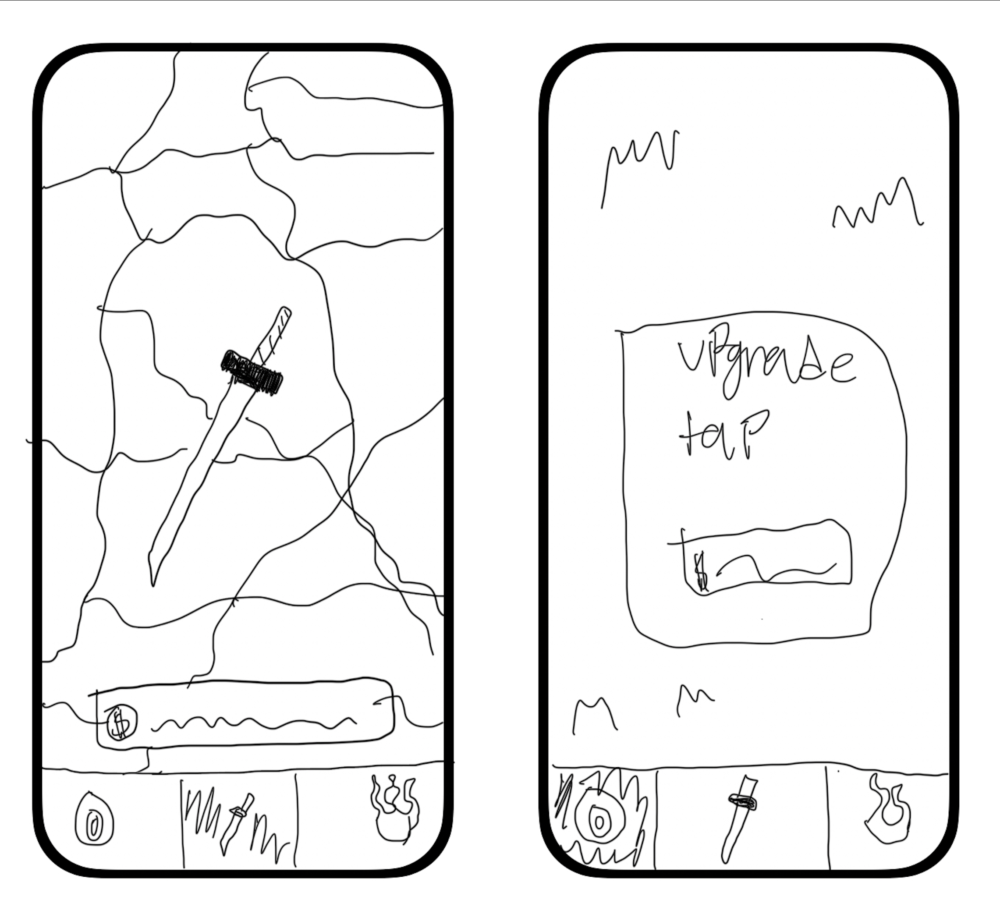

# Swordsmith App

## About Swordsmith

Swordsmith is a fun tapping game where you forge exquisite swords for profit! Start off by tapping the large Katana in the center of the screen. Each tap makes you 1 gold. If that's not your thing, you can shake your phone for the same effect! Finger or hand getting tired from tapping or shaking? Navigate over to the Training Grounds! Train yourself and apprentice who will start making swords under your name, and start earning money over time. Just watch out, because as his skill improves his pay raises get more and more expensive! Earn as much gold as you can and become the top Blacksmith in the world!

## Wireframe Image

## HIG's Implementation

In Swordsmith, I used two seperate idea's from the Human Interface Guidelines in order to improve the app:

- Buttons
- Tab bars.

First I implemented some valuable HIG Button guidelines. In HIG it states:

- "Make buttons easy for people to use. It’s essential to include enough space around a button so that people can visually distinguish it from surrounding components and content. Giving a button enough space is also critical for helping people select or activate it, regardless of the method of input they use. As a general rule, a button needs a hit region of at least 44x44 pt..."
- "Always include a press state for a custom button. Without a press state, a button can feel unresponsive, making people wonder if it’s accepting their input".

I implemented this most prominently on the Training page of my app. If you navigate over, you will see a button. I first make it obvious that if you don't have enough money, you cannot afford to buy it and therefore can't use the button. The button is grayed out and doesn't respond when clicked. Howver when it's clicked it turns into a fully functioning button. It gets color which gives the indication it can be used. It is large enough that users won't have a problem clicking it either. Lastly, when clicked it has a pressed state, darkening the yellow of the button to give the user feedback that the buton is being pushed. I also used similar standards when creating the Katana on the Forge page. However the pressed state is a scale instead of a color change, which gives the impression you are pushing it down. When released it springs back up to full size. I also give it a large area where you can press it so that even if you don't click exactly on the Katana, itw ill stil register as a tap.

Secondly, I implemented the HIG recommendation for tab bars. I followed many of the guidelines for this section, but mainly included the two guidelines that follow:

- "Make sure the tab bar is visible when people navigate to different sections of your app. If you hide the tab bar, people can forget which area of the app they’re in."
- "Include tab labels to help with navigation. A tab label appears beneath or beside a tab bar icon, and can aid navigation by clearly describing the type of content or functionality the tab contains. Use single words whenever possible."

In my application, at the bottom of every page is the Tab Bar. It currently has two main pages, a Training Page and a Forge Page. These pages will appear Grayed out when they are innactive. The active page highlights with a color specific to the page and will give the indication that it is being used. No matter what page you are on, I made sure the tab bar was available so the user never gets lost. This followed the first point of the HIG guidlines. Following the second guideline I mentioned, I put labels beneath each Tab Bar icon that indicates what the page is and does. This can give some guidance to users, so if they happen to forget what the icon means they can refer to the label. I also only used single words as to not become too complex.

These were the two ways that I chose to implement the Human Interface Guidelines into my application.
